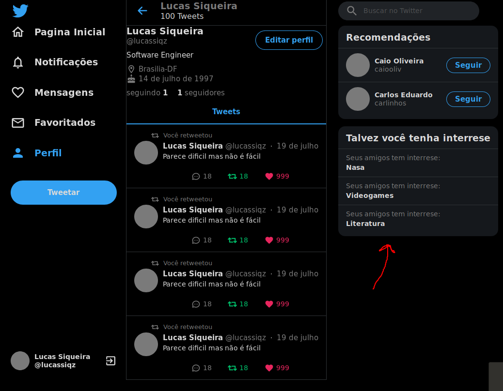
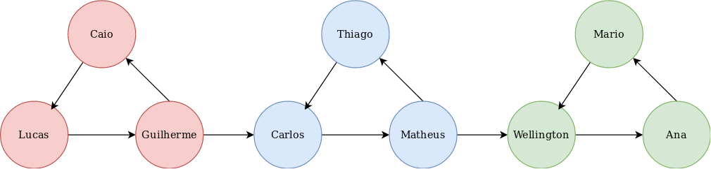

# TWTR2

**Número da Lista**: 2 
**Conteúdo da Disciplina**: Grafos 2 
**Número da Dupla:** 13 

## Alunos
|Matrícula | Aluno |
| -- | -- |
| 16/0123119  |  Guilherme de Oliveira Aguiar |
| 15/0137567  |  Lucas Siqueira Rodrigues |

## Sobre 

O projeto é um clone do twitter onde implementamos um sistema de recomendação de interesses. A funcionalidade foi feita a partir de um algoritmo de componentes fortemente conectados, sendo já iniciado com um usuário logado, onde é possível fazer logout e logar com outros usuários pré-cadastrados, chamada "Talvez você tenha interrese". O sistema não vai recomendar interesses pré-cadastrados que já estejam na lista de interesses, só serão recomendados interesses que estejam na lista de interesses de  usuários do seu grupo/panelinha/bolha (componente fortemente conectado). O projeto não possui banco de dados, as alterações só são mantidas enquanto o pagina esta em execução, ao atualizar a pagina por exemplo os dados voltam para o estado inicial, e fizemos um simples deploy, que pode ser acessado pelo link [https://grafos2-twtr2.netlify.app/](https://grafos2-twtr2.netlify.app/) para facilitar o teste do projeto, não sendo necessário nenhuma instalação adicional.

## Screenshots

### Aba "Talvez você tenha interesse"

 

### Representação do gráfico de seguidores do projeto

 

## Instalação 
**Linguagem**: 

- [TypeScript](https://www.typescriptlang.org/)

**Tecnologias**: 

- [React](https://pt-br.reactjs.org/)
- [React-sticky-box](https://www.npmjs.com/package/react-sticky-box)
- [Styled-components](https://styled-components.com/)
- [Styled-icons](https://styled-icons.js.org/)
- [Eslint](https://eslint.org/)
- [Prettier](https://prettier.io/)

O deploy da aplicação foi feito pelo netlify na url: [https://grafos2-twtr2.netlify.app/](https://grafos2-twtr2.netlify.app/)

Caso queira executar o projeto em sua maquina, é necessário ter o node instalado, recomendamos a utilização do yarn como gerenciador de pacotes, porém também pode ser utilizado com o npm, e siga os seguintes passos:

Clone o repositório
> git clone https://github.com/projeto-de-algoritmos/Grafos2_TWTR2.git

Acesse a pasta
> cd Grafos2_TWTR2

Instale as dependências
> yarn

Execute o projeto
> yarn start

## Uso 
Ao iniciar a aplicação, você pode trocar de usuário (a lista de usuários disponíveis esta logo abaixo), clicando na seta ao lado do nome do usuário logado no canto inferior esquerdo e também pode seguir usuários na sua lista de recomendações, o que gera uma nova lista.

#### Usuários disponíveis:
- lucassiqz
- guilherme-aguiar
- caiooliv
- carlinhos
- matheus-rn
- thiagoo
- we11
- an@_maria
- mario

#### Interesses disponíveis:
- Matemática
- Videogames
- Literatura
- Nasa
- Politica
- Feminismo
- Coronavirus
- Economia
- Filmes
- Taratino
- Series
- Famosos

## Referências

- [DFS](https://www.algorithms-and-technologies.com/dfs/javascript) 

- [Twitter UI Clone Tutorial](https://www.youtube.com/watch?v=K-8z_4xvT3o&t)

